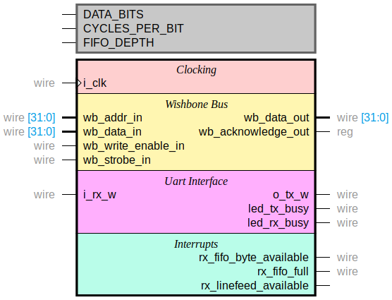

<!--
*** Thanks for checking out the Best-README-Template. If you have a suggestion
*** that would make this better, please fork the repo and create a pull request
*** or simply open an issue with the tag "enhancement".
*** Thanks again! Now go create something AMAZING! :D
-->


<!-- PROJECT SHIELDS -->
<!--
*** I'm using markdown "reference style" links for readability.
*** Reference links are enclosed in brackets [ ] instead of parentheses ( ).
*** See the bottom of this document for the declaration of the reference variables
*** for contributors-url, forks-url, etc. This is an optional, concise syntax you may use.
*** https://www.markdownguide.org/basic-syntax/#reference-style-links
-->
[![Contributors][contributors-shield]][contributors-url]
[![Forks][forks-shield]][forks-url]
[![Stargazers][stars-shield]][stars-url]
[![Issues][issues-shield]][issues-url]
[![MIT License][license-shield]][license-url]


<!-- PROJECT LOGO -->
<br />
<p align="center">
  <a href="https://github.com/rfrazier716/wb-uart">
    
  </a>

  <h3 align="center">WB-UART</h3>

  <p align="center">
    A wishbone compliant, Synthesizable UART Core 
    <br />
    <a href="https://github.com/rfrazier716/wb-uart"><strong>Explore the docs »</strong></a>
    <br />
    <a href="https://github.com/rfrazier716/wb-uart/issues">Report Bug</a>
    ·
    <a href="https://github.com/rfrazier716/wb-uart/issues">Request Feature</a>
  </p>
</p>


<!-- TABLE OF CONTENTS -->
<details open="open">
  <summary>Table of Contents</summary>
  <ol>
    <li>
      <a href="#about-the-project">About The Project</a>
      <ul>
        <li><a href="#built-with">Built With</a></li>
      </ul>
    </li>
    <li>
      <a href="#getting-started">Getting Started</a>
      <ul>
        <li><a href="#prerequisites">Prerequisites</a></li>
        <li><a href="#installation">Installation</a></li>
      </ul>
    </li>
    <li><a href="#usage">Usage</a></li>
    <li><a href="#roadmap">Roadmap</a></li>
    <li><a href="#contributing">Contributing</a></li>
    <li><a href="#license">License</a></li>
    <li><a href="#contact">Contact</a></li>
    <li><a href="#acknowledgements">Acknowledgements</a></li>
  </ol>
</details>


<!-- ABOUT THE PROJECT -->
## About The Project

WB-UART is a Basic, parameterized UART Core written in Synthesizable Verilog and simulated with Verilator. Baud rate has been verified up to 460.8k. Currently the core only supports 8-data bits with no parity and one stop bit. 

It has been synthesized and tested on a [DE10-Nano](de10-nano.terasic.com
) with a 50Mhz Clock. 

<!-- GETTING STARTED -->
## Getting Started

Simulating the core requires Verilator and a c++ compiler. Software for Synthesis depends on vendor tools

### Prerequisites For Simulation

The Following Software is required for Simulation
* Verilator 4.0 or later
* gcc or clang (has been tested with gcc 9.3.0)
* make or ninja
* cmake 3.12 or later
* Boost 1.71.0 or later

On Ubuntu they can be installed from the package manager with
```
sudo apt install verilator gcc cmake libboost-all-dev
```

### Prerequesites for UnitTests & examples

To run the registered CTests you will need additional libraries. If you don't want build or run any tests you can comment out the line `SET(ENABLE_TESTS TRUE)` in CMakeLists.txt
* Catch2 Unit Test Framework


Catch2 must be [compiled from source](https://github.com/catchorg/Catch2/tree/v2.x). If you install it in a nonstandard location you will have to update the CMake file to find the library


### Installation

1. Clone the repo
   ```sh
   git clone https://github.com/rfrazier716/wb-uart.git
   ```
2. cd into the project
    ```sh
    cd wb-uart
    ```
3. make a directory build and cd into that directory
    ```sh
    mkdir build; cd build
    ```
4. run cmake to generate the makefiles and build
    ```sh
    cmake ../; make
    ```
6. (Optional) run Unit Tests to verify library
    ```sh
    ctest
    ```


<!-- USAGE EXAMPLES -->
## Usage

This module is meant as a core to be integrated into other Verilog modules. However a couple of example modules exist in bench/verilog for make a top level module using the wb-uart core.
<!-- ROADMAP -->
## Roadmap
I plan on fully documenting the submodules as well as adding more synthesizable examples in the future.

<!-- CONTRIBUTING -->
## Contributing

Contributions are what make the open source community such an amazing place to be learn, inspire, and create. Any contributions you make are **greatly appreciated**.

1. Fork the Project
2. Create your Feature Branch (`git checkout -b feature/AmazingFeature`)
3. Commit your Changes (`git commit -m 'Add some AmazingFeature'`)
4. Push to the Branch (`git push origin feature/AmazingFeature`)
5. Open a Pull Request


<!-- LICENSE -->
## License
Distributed under the MIT License. See `LICENSE` for more information.


<!-- CONTACT -->
## Contact


Project Link: [https://github.com/rfrazier716/wb-uart](https://github.com/rfrazier716/wb-uart)


<!-- ACKNOWLEDGEMENTS -->
## Acknowledgements
* [Img Shields](https://shields.io)
* [Choose an Open Source License](https://choosealicense.com)
* [GitHub Pages](https://pages.github.com)


<!-- MARKDOWN LINKS & IMAGES -->
<!-- https://www.markdownguide.org/basic-syntax/#reference-style-links -->
[contributors-shield]: https://img.shields.io/github/contributors/rfrazier716/wb-uart.svg?style=for-the-badge
[contributors-url]: https://github.com/rfrazier716/wb-uart/graphs/contributors
[forks-shield]: https://img.shields.io/github/forks/rfrazier716/wb-uart.svg?style=for-the-badge
[forks-url]: https://github.com/rfrazier716/wb-uart/network/members
[stars-shield]: https://img.shields.io/github/stars/rfrazier716/wb-uart.svg?style=for-the-badge
[stars-url]: https://github.com/rfrazier716/wb-uart/stargazers
[issues-shield]: https://img.shields.io/github/issues/rfrazier716/wb-uart.svg?style=for-the-badge
[issues-url]: https://github.com/rfrazier716/wb-uart/issues
[license-shield]: https://img.shields.io/github/license/rfrazier716/wb-uart.svg?style=for-the-badge
[license-url]: https://github.com/rfrazier716/wb-uart/blob/master/LICENSE.txt